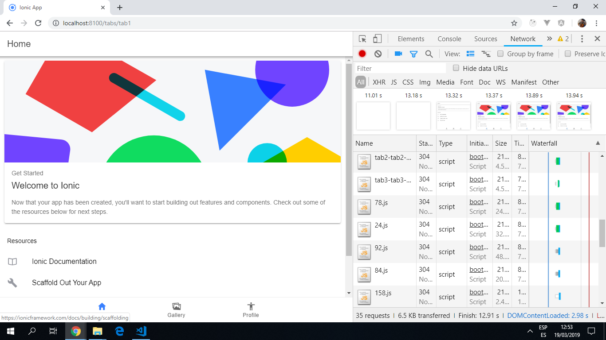

# Ionic Angular Photostore

App to search for and display photos using the [Ionic 4 framework](https://ionicframework.com/docs).

## Table of contents

* [General info](#general-info)
* [Screenshots](#screenshots)
* [Technologies](#technologies)
* [Setup](#setup)
* [Features](#features)
* [Status](#status)
* [Inspiration](#inspiration)
* [Contact](#contact)

## General info

## Screenshots

## Technologies

* Ionic/angular - version 4.0.0

## Setup

* To start the server on _localhost://8100_ type: 'ionic serve'

## Code Examples

* Example 1

## Features

* Example 1

## Status & To-do list

* Status: Working bare-bones. Shows 3 tabs. In development.

* To-do: Add a lot more detail/styling to front page.

## Inspiration

Project inspired by [ionic Docs](https://ionicframework.com/docs/) Guide: ['Your First Ionic App - Framework v4'](https://ionicframework.com/docs/developer-resources/guides/first-app-v4/intro).

## Contact

Created by [ABateman](https://www.andrewbateman.org) - feel free to contact me!